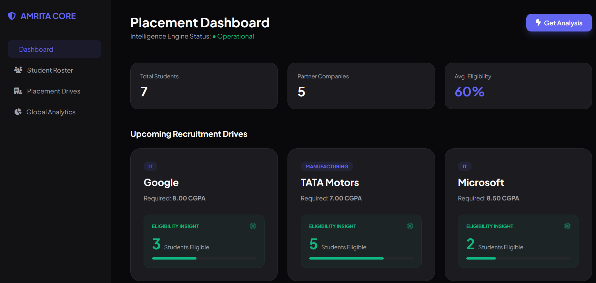
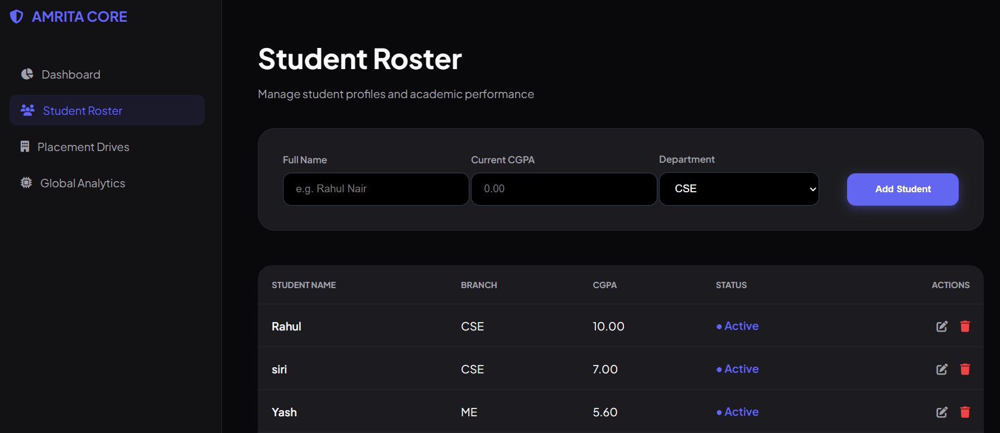
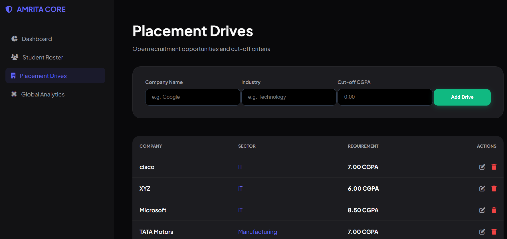
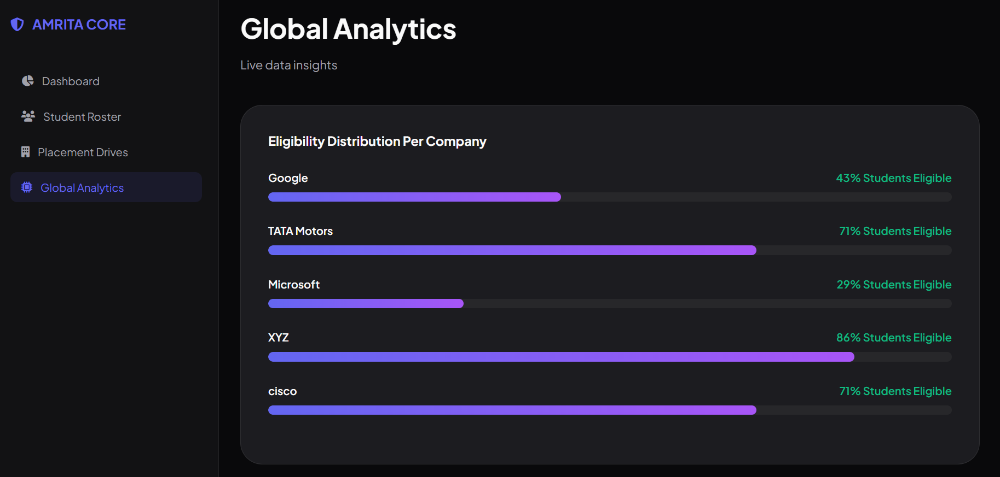

# 🎓 Amrita Placement Insight Portal (APIP)

**APIP** is a professional-grade, full-stack decision support system designed for university placement cells. The application automates student eligibility auditing for recruitment drives using a unique **Decoupled Logic Architecture**, where the web interface and analytical engine operate independently through a shared database.

---

## 🛠 Tech Stack

| Layer | Technologies Used |
| :--- | :--- |
| **Frontend** | HTML5, CSS3 (Flexbox/Grid), FontAwesome, Google Fonts (Plus Jakarta Sans) |
| **Backend** | PHP 8.x (PDO), Python 3.x |
| **Database** | MySQL 8.x (Relational Schema) |
| **Environment** | WAMP Server (Apache 2.4) |
| **Integrations** | `mysql-connector-python`, PHP `shell_exec()` |

---

## ⚙️ Technical Workflow (System Architecture)

The system follows a **Modular Full-Stack Workflow**, ensuring high performance and data integrity:

1.  **Data Management (CRUD):** Administrative users input student academic profiles (CGPA, Branch) and recruitment drive criteria (Min CGPA, Industry) via PHP-driven forms.
2.  **Server-Side Validation:** All inputs are sanitized and validated via PHP before being committed to the **MySQL Relational Database**.
3.  **The Analytical Bridge:** Upon clicking the **"Get Analysis"** trigger, the web server invokes the **Python Script** via a shell command.
4.  **Decoupled Logic Processing:** The Python engine connects to MySQL, performs a comparative audit of the entire student roster against all active drives, and populates the `analytics_results` table.
5.  **Data Persistence:** Using `float` conversion and SQL `DELETE/INSERT` logic, Python ensures accurate eligibility counts without redundant data.
6.  **Visualization:** The Dashboard fetches these calculated insights and visualizes them using CSS-driven progress bars and KPI cards.

---

## 🚀 Key Features

- **Intelligence Engine:** Real-time background auditing powered by Python.
- **Enterprise UI:** Modern "SaaS-style" dark-themed dashboard with a professional sidebar layout.
- **Full CRUD Suite:** Complete Create, Read, Update, and Delete functionality for both Students and Placement Drives.
- **Data Integrity:** Built-in validation to prevent out-of-range academic data (0.00 - 10.00 CGPA).
- **Relational Schema:** Optimized SQL tables with `DECIMAL(4,2)` precision to support perfect 10.0 scores.

---

## 📸 Screenshots

### 🖥 Main Dashboard


### 👥 Student Roster


### 🏢 Placement Drives


### 📊 Global Analytics


---

## 📂 Project Structure

```text
├── db.php                # Centralized PDO Database Connection
├── dashboard.php         # Main Visualization Command Center
├── roster.php            # Student Management Module
├── drives.php            # Company Recruitment Module
├── analytics.php         # Visual Data Insight Page
├── edit.php              # Multi-entity Modification Form
├── placement_engine.py   # Python Analytical Logic Script
├── run_analysis.php      # PHP-Python Integration Bridge
├── save_data.php         # Data Insertion & Validation Logic
├── update_data.php       # Data Modification & Validation Logic
├── delete_data.php       # Data Removal & Integrity Logic
├── data_schema.sql       # Complete SQL Database Export
└── screenshots/          # Project Previews

---

## 🔧 Installation & Setup

1.  **Clone the Repository:** `git clone https://github.com/YOUR_USERNAME/CipherVault-Pro.git`
2.  **Web Server:** Move the files to your WAMP/XAMPP `www` folder.
3.  **Database:** Create a database named `data_schema.sql` in phpMyAdmin. 
4.  **Python Configuration:** Install requirements: pip install mysql-connector-python,Update the absolute Python path in run_analysis.php. Ensure Python is installed on your system and added to your **Environment Variables**.
5.  **Run:** Access the app via `http://localhost/amrita-placement-portal/dashboard.php`.

--- 

**Developed by Snehitha**  
*Full-Stack Developer*
